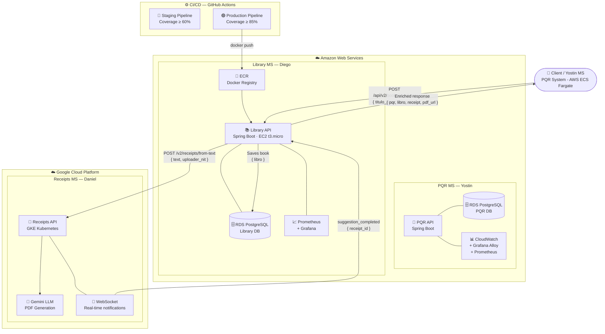

## 🏗️ Multicloud Architecture

## 🏗️ Multicloud Architecture



### Flow Description
1. **Yostin's MS** detects 5 PQRs for the same book → calls `POST /api/v2/books/purchase`
2. **Library API** saves the book in RDS → calls Daniel's MS
3. **Daniel's MS** generates accounting PDF with Gemini LLM → notifies via WebSocket
4. **Library API** returns enriched response with all 3 entities

### Final Response
```json
{
  "pqr":     { "id": "uuid", "asunto": "Clean Code", "responsable": "...", "conteo": 5 },
  "libro":   { "id": 1, "title": "Clean Code", "author": "Robert Martin", "isbn": "..." },
  "receipt": { "id": "uuid", "empresa": "Biblioteca Central", "valor": 85000, "pdf_url": "..." },
  "pdf_url": "http://34.60.178.4/v2/receipts/{id}/pdf"
}
```

# 📋 PQR Management API

API REST para la gestión de **PQRs** (Peticiones, Quejas y Reclamos), revisores y documentos adjuntos. Construida con **Spring Boot 4** y **Java 21**, usando PostgreSQL como base de datos.

---

## 🧱 Stack Tecnológico

| Componente        | Tecnología                        |
|-------------------|-----------------------------------|
| Lenguaje          | Java 21                           |
| Framework         | Spring Boot 4                     |
| Base de Datos     | PostgreSQL                        |
| Build Tool        | Maven                             |
| Contenedor        | Docker (multi-stage build)        |
| Observabilidad    | Spring Actuator + Prometheus + Grafana Alloy |
| Cobertura tests   | JaCoCo                            |

---

## ⚙️ Variables de Entorno

Antes de ejecutar la aplicación, debes configurar las siguientes variables de entorno:

| Variable                    | Descripción                                         | Ejemplo                                         |
|-----------------------------|-----------------------------------------------------|-------------------------------------------------|
| `SPRING_DATASOURCE_URL`     | URL de conexión a PostgreSQL                        | `jdbc:postgresql://localhost:5432/pqr_db`       |
| `SPRING_DATASOURCE_USERNAME`| Usuario de la base de datos                         | `postgres`                                      |
| `SPRING_DATASOURCE_PASSWORD`| Contraseña de la base de datos                      | `supersecret`                                   |
| `SPRING_PROFILES_ACTIVE`    | Perfil activo de Spring (default: `test`)           | `test` / `production`                           |
| `PQR_BOOK_ORDER_THRESHOLD`  | Umbral para pedidos de libros                       | `5`                                             |
| `SERVICES_BOOK_ORDER_URL`   | URL del servicio externo de pedidos de libros       | `http://book-service:8081`                      |
| `GRAFANA_API_KEY`           | API Key para envío de métricas a Grafana Cloud      | `glc_eyJ...`                                    |

---

## 🚀 Instalación y Ejecución

### Opción 1 — Ejecución Local con Maven

**Requisitos:** Java 21, Maven 3.9+, PostgreSQL corriendo localmente.

```bash
# 1. Clonar el repositorio
git clone <url-del-repo>
cd pqr

# 2. Configurar variables de entorno
export SPRING_DATASOURCE_URL=jdbc:postgresql://localhost:5432/pqr_db
export SPRING_DATASOURCE_USERNAME=postgres
export SPRING_DATASOURCE_PASSWORD=tu_password
export PQR_BOOK_ORDER_THRESHOLD=5
export SERVICES_BOOK_ORDER_URL=http://localhost:8081

# 3. Compilar y ejecutar
mvn clean package -DskipTests
java -jar target/pqr-0.0.1-SNAPSHOT.jar
```

La aplicación estará disponible en `http://localhost:8080`.

---

### Opción 2 — Ejecución con Docker

**Requisitos:** Docker instalado.

```bash
# 1. Construir la imagen
docker build -t pqr-api .

# 2. Ejecutar el contenedor
docker run -p 8080:8080 \
  -e SPRING_DATASOURCE_URL=jdbc:postgresql://host.docker.internal:5432/pqr_db \
  -e SPRING_DATASOURCE_USERNAME=postgres \
  -e SPRING_DATASOURCE_PASSWORD=tu_password \
  -e SPRING_PROFILES_ACTIVE=test \
  -e PQR_BOOK_ORDER_THRESHOLD=5 \
  -e SERVICES_BOOK_ORDER_URL=http://book-service:8081 \
  pqr-api
```

> **Nota:** Usa `host.docker.internal` para conectarte a un PostgreSQL corriendo en tu máquina local desde Docker.

---

### Opción 3 — Ejecución con Docker Compose (recomendado)

Crea un archivo `docker-compose.yml` en la raíz del proyecto:

```yaml
version: '3.8'
services:
  db:
    image: postgres:16
    environment:
      POSTGRES_DB: pqr_db
      POSTGRES_USER: postgres
      POSTGRES_PASSWORD: tu_password
    ports:
      - "5432:5432"

  app:
    build: .
    ports:
      - "8080:8080"
    depends_on:
      - db
    environment:
      SPRING_DATASOURCE_URL: jdbc:postgresql://db:5432/pqr_db
      SPRING_DATASOURCE_USERNAME: postgres
      SPRING_DATASOURCE_PASSWORD: tu_password
      SPRING_PROFILES_ACTIVE: test
      PQR_BOOK_ORDER_THRESHOLD: 5
      SERVICES_BOOK_ORDER_URL: http://book-service:8081
```

```bash
docker compose up --build
```

---

## 🧪 Ejecutar Tests

```bash
# Perfil testing (cobertura mínima: 65%)
mvn clean verify -Ptesting

# Perfil production (cobertura mínima: 80%)
mvn clean verify -Pproduction
```

---

## 📡 Endpoints de la API

Base URL: `http://localhost:8080/api/v2`

---

### 📁 PQR — `/api/v2/pqr`

#### `POST /api/v2/pqr` — Crear un PQR

Crea un nuevo PQR con archivos adjuntos opcionales. La petición debe enviarse como `multipart/form-data`.

**Partes del formulario:**

| Parte    | Tipo                  | Requerido | Descripción                            |
|----------|-----------------------|-----------|----------------------------------------|
| `pqr`    | JSON (application/json) | ✅       | Datos del PQR (ver estructura abajo)   |
| `files`  | Archivo(s)            | ❌        | Archivos adjuntos                      |

**Estructura de la parte `pqr`:**

```json
{
  "type": "peticion",
  "customerEmail": "cliente@ejemplo.com",
  "description": "Descripción detallada del PQR",
  "subject": "Asunto del PQR",
  "book": {
    "bookTitle": "Clean Code",
    "bookAuthor": "Robert C. Martin"
  }
}
```

| Campo            | Tipo   | Requerido | Validación                              |
|------------------|--------|-----------|------------------------------------------|
| `type`           | String | ✅        | Solo: `peticion`, `queja`, `reclamo`    |
| `customerEmail`  | String | ✅        | Formato de email válido                 |
| `description`    | String | ✅        | No vacío                                |
| `subject`        | String | ✅        | No vacío                                |
| `book`           | Objeto | ❌        | Ver estructura `BookDto` abajo          |
| `book.bookTitle` | String | ✅ (si book) | No vacío                             |
| `book.bookAuthor`| String | ✅ (si book) | No vacío                             |

**Respuesta exitosa:** `201 Created` con el objeto `Pqr` creado.

---

#### `PATCH /api/v2/pqr/{id}` — Actualizar un PQR

Actualiza parcialmente un PQR existente.

**Path param:** `id` — ID del PQR a actualizar.

**Body (JSON):**

```json
{
  "type": "queja",
  "customerEmail": "nuevo@ejemplo.com",
  "description": "Nueva descripción",
  "subject": "Nuevo asunto",
  "book": {
    "bookTitle": "The Pragmatic Programmer",
    "bookAuthor": "Andy Hunt"
  }
}
```

Todos los campos son opcionales. Solo se actualizan los campos que se envíen.

**Respuesta exitosa:** `200 OK` con el objeto `Pqr` actualizado.

---

#### `GET /api/v2/pqr` — Listar todos los PQRs

No requiere parámetros.

**Respuesta exitosa:** `200 OK` con una lista de objetos `Pqr`.

---

#### `DELETE /api/v2/pqr/{id}` — Eliminar un PQR

**Path param:** `id` — ID del PQR a eliminar.

**Respuesta exitosa:** `200 OK` con el mensaje `"Pqr deleted correctly"`.

---

#### `POST /api/v2/pqr/try` — Endpoint de prueba

Recibe un JSON arbitrario y lo retorna tal como llega. Útil para diagnóstico.

```json
{
  "cualquier": "dato",
  "de": "prueba"
}
```

**Respuesta exitosa:** `200 OK` con el mismo body recibido.

---

### 👤 Reviewer — `/api/v2/reviewer`

#### `POST /api/v2/reviewer` — Crear un Reviewer

**Body (JSON):**

```json
{
  "name": "Juan Pérez",
  "email": "juan@ejemplo.com"
}
```

| Campo   | Tipo   | Requerido | Validación              |
|---------|--------|-----------|--------------------------|
| `name`  | String | ✅        | No vacío                |
| `email` | String | ✅        | Formato de email válido |

**Respuesta exitosa:** `201 Created` con el objeto `Reviewer` creado.

---

#### `DELETE /api/v2/reviewer/{id}` — Eliminar un Reviewer

**Path param:** `id` — ID del reviewer a eliminar.

**Respuesta exitosa:** `200 OK` con el mensaje `"Reviewer deleted correctly"`.

---

#### `GET /api/v2/reviewer` — Listar todos los Reviewers

No requiere parámetros.

**Respuesta exitosa:** `200 OK` con lista de objetos `Reviewer`.

---

### 📄 Document — `/api/v2/document`

#### `POST /api/v2/document` — Subir un documento

Sube un archivo al sistema. La petición debe enviarse como `multipart/form-data`.

| Parte  | Tipo    | Requerido | Descripción          |
|--------|---------|-----------|----------------------|
| `file` | Archivo | ✅        | El archivo a subir   |

**Respuesta exitosa:** `201 Created`

```json
{
  "id": "abc123",
  "fileName": "contrato.pdf",
  "storageUrl": "https://storage.ejemplo.com/documentos/contrato.pdf"
}
```

---

### 🩺 Actuator / Salud

| Endpoint                  | Descripción                              |
|---------------------------|------------------------------------------|
| `GET /actuator/health`    | Estado de salud de la aplicación         |
| `GET /actuator/prometheus`| Métricas en formato Prometheus           |

---

## 📬 Ejemplos en Postman

### Configuración inicial

1. Abre Postman y crea una **colección nueva** llamada `PQR API`.
2. Crea una variable de colección `base_url` con valor `http://localhost:8080`.

---

### Crear un PQR con archivo adjunto

1. Método: `POST`
2. URL: `{{base_url}}/api/v2/pqr`
3. En la pestaña **Body** selecciona `form-data`
4. Agrega las siguientes claves:

| Key     | Type | Value |
|---------|------|-------|
| `pqr`   | Text (con Content-Type `application/json`) | `{"type":"peticion","customerEmail":"test@test.com","description":"Mi descripción","subject":"Mi asunto"}` |
| `files` | File | *(selecciona uno o más archivos)* |

> **Importante:** Para la clave `pqr` en Postman, haz clic en el ícono de engranaje junto al campo y establece el `Content-Type` como `application/json`.

---

### Crear un Reviewer

1. Método: `POST`
2. URL: `{{base_url}}/api/v2/reviewer`
3. Pestaña **Body** → `raw` → `JSON`

```json
{
  "name": "Ana Gómez",
  "email": "ana@ejemplo.com"
}
```

---

### Subir un Documento

1. Método: `POST`
2. URL: `{{base_url}}/api/v2/document`
3. Pestaña **Body** → `form-data`

| Key    | Type | Value                       |
|--------|------|-----------------------------|
| `file` | File | *(selecciona tu archivo)*   |

---

### Actualizar un PQR

1. Método: `PATCH`
2. URL: `{{base_url}}/api/v2/pqr/{id}` (reemplaza `{id}` por el ID real)
3. Pestaña **Body** → `raw` → `JSON`

```json
{
  "type": "queja",
  "subject": "Asunto actualizado"
}
```

---

## 🔁 CI/CD — GitHub Actions

El proyecto incluye tres pipelines:

| Pipeline              | Archivo               | Se ejecuta en                                 | Cobertura mínima |
|-----------------------|-----------------------|-----------------------------------------------|------------------|
| Branch Policy         | `branching-policy.yml`| PRs hacia `main`                              | —                |
| Testing Environment   | `testing.yml`         | Push a `feature/**`, `release/**`, `hotfix/**`| 65%              |
| Production Environment| `production.yml`      | Push a `main`                                 | 80%              |

### Política de ramas

Para hacer merge a `main` mediante un Pull Request, la rama de origen debe seguir alguno de estos prefijos:

- `feature/`
- `release/`
- `hotfix/`

---

## 📊 Observabilidad

La aplicación expone métricas via Prometheus en `/actuator/prometheus`. El agente **Grafana Alloy** recoge estas métricas cada 15 segundos y las reenvía a Grafana Cloud.

Para ejecutar Alloy localmente con Docker:

```bash
# Construir la imagen de Alloy
docker build -f alloy.Dockerfile -t pqr-alloy .

# Ejecutar con la API Key de Grafana
docker run -e GRAFANA_API_KEY=tu_api_key pqr-alloy
```

---

## 📁 Estructura del Proyecto

```
src/
└── main/
    └── java/com/devops/api/pqr/
        ├── pqr/              # Módulo PQR (controller, service, dto, entity)
        ├── reviewer/         # Módulo Reviewer
        ├── document/         # Módulo Document
        └── PqrApplication.java
```
## 🏗️ Multicloud Architecture

mermaid
flowchart TD
Client(["👤 Client / Yostin MS\nPQR System - AWS ECS Fargate"])

    subgraph AWS ["☁️ Amazon Web Services"]
        subgraph YostinMS ["PQR MS — Yostin"]
            PQR["🔔 PQR API\nSpring Boot"]
            PQRDB[("🗄️ RDS PostgreSQL\nPQR DB")]
            CW["📊 CloudWatch\n+ Grafana Alloy\n+ Prometheus"]
            PQR --- PQRDB
            PQR --- CW
        end

        subgraph DiegoMS ["Library MS — Diego"]
            LIB["📚 Library API\nSpring Boot · EC2 t3.micro"]
            LIBDB[("🗄️ RDS PostgreSQL\nLibrary DB")]
            ECR["🐳 ECR\nDocker Registry"]
            MON["📈 Prometheus\n+ Grafana"]
            LIB --- LIBDB
            LIB --- MON
            ECR --> LIB
        end
    end

    subgraph GCP ["☁️ Google Cloud Platform"]
        subgraph DanielMS ["Receipts MS — Daniel"]
            REC["🧾 Receipts API\nGKE Kubernetes"]
            GEMINI["🤖 Gemini LLM\nPDF Generation"]
            WS["🔌 WebSocket\nReal-time notifications"]
            REC --> GEMINI
            REC --- WS
        end
    end

    subgraph CICD ["⚙️ CI/CD — GitHub Actions"]
        PIPE1["🔵 Staging Pipeline\nCoverage ≥ 60%"]
        PIPE2["🟢 Production Pipeline\nCoverage ≥ 85%"]
    end

    Client -->|"POST /api/v2/books/purchase\n{ titulo_libro, autor, pqr }"| LIB
    LIB -->|"Saves book\n{ libro }"| LIBDB
    LIB -->|"POST /v2/receipts/from-text\n{ text, uploader_nit }"| REC
    WS -->|"suggestion_completed\n{ receipt_id }"| LIB
    PIPE2 -->|"docker push"| ECR

    LIB -->|"Enriched response\n{ pqr, libro, receipt, pdf_url }"| Client


### Flow Description
1. *Yostin's MS* detects 5 PQRs for the same book → calls POST /api/v2/books/purchase
2. *Library API* saves the book in RDS → calls Daniel's MS
3. *Daniel's MS* generates accounting PDF with Gemini LLM → notifies via WebSocket
4. *Library API* returns enriched response with all 3 entities

### Final Response
json
{
"pqr":     { "id": "uuid", "asunto": "Clean Code", "responsable": "...", "conteo": 5 },
"libro":   { "id": 1, "title": "Clean Code", "author": "Robert Martin", "isbn": "..." },
"receipt": { "id": "uuid", "empresa": "Biblioteca Central", "valor": 85000, "pdf_url": "..." },
"pdf_url": "http://34.60.178.4/v2/receipts/{id}/pdf"
}
---
